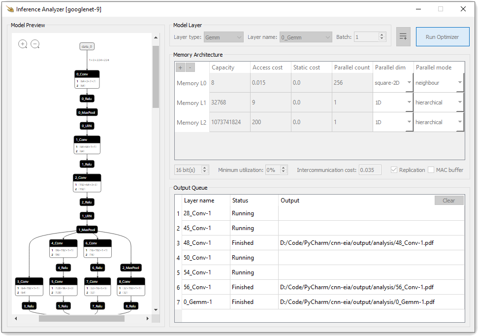

# Convolutional Neural Networks Inference Analyzer

[Convolutional Neural Networks Inference Analyzer (CNN-IA)](https://github.com/e-ahmedwaleed/cnn-eia)
is a tool to guide designers to reach an optimal hardware using an auto-optimizer
[Interstellar-CNN-scheduler](https://github.com/xuanyoya/Interstellar-CNN-scheduler)
to find energy-efficient accelerator designs for given DNNs.



## Requirements

[python-3.9.13-amd64](https://www.python.org/downloads/release/python-3913/)
, [VC_redist.x64](https://docs.microsoft.com/en-us/cpp/windows/latest-supported-vc-redist?view=msvc-170)

```sh
python -m pip install --upgrade pip
python -m pip install PyQt5 PyQtWebEngine numpy onnx onnxruntime netron tf2onnx fpdf
```
